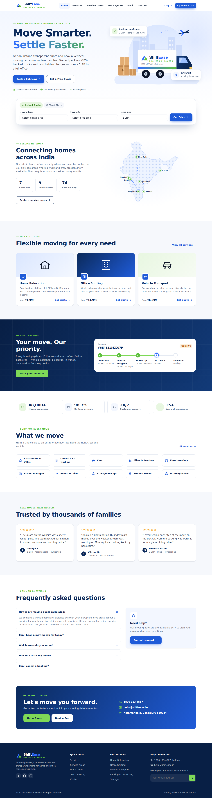
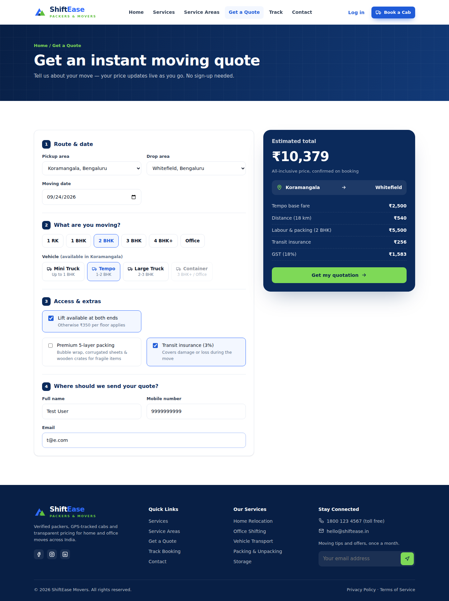
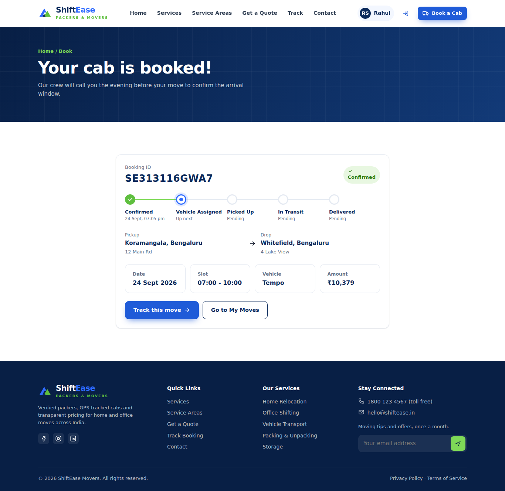
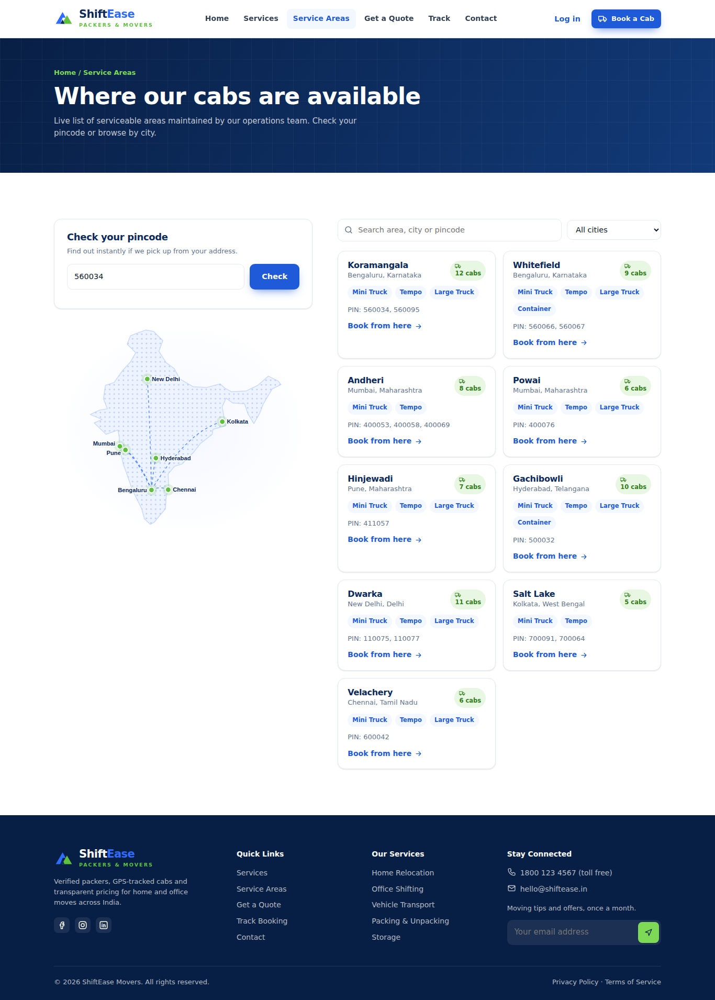
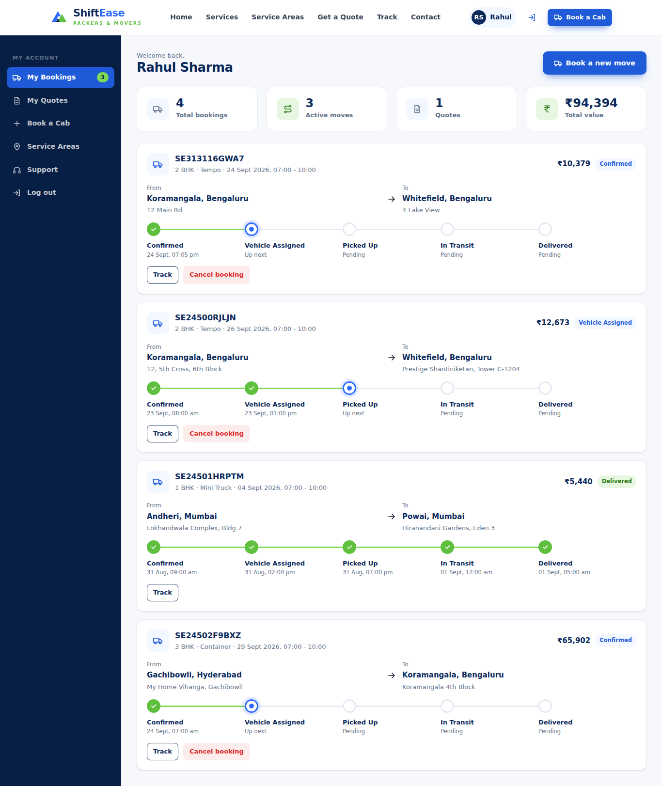
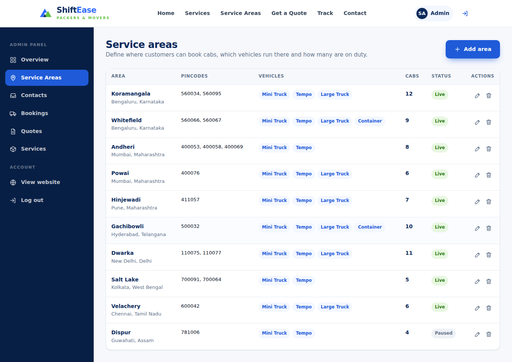
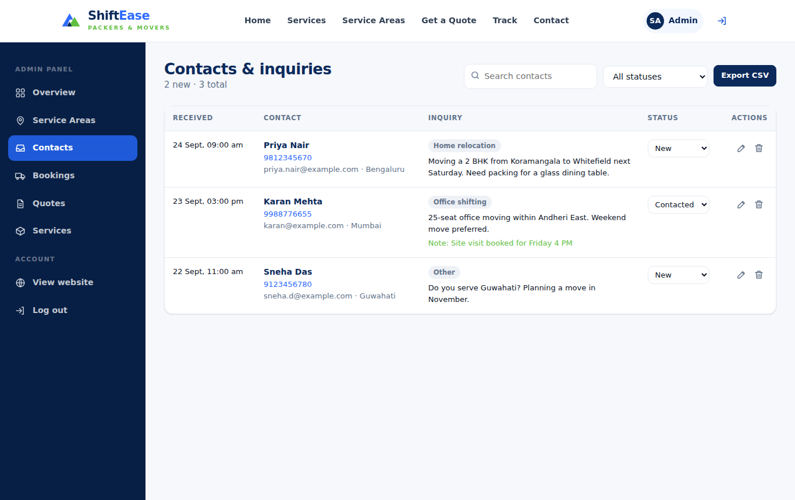

# ShiftEase Movers — MERN Packers & Movers Platform

MERN stack capstone project: an online application for a packers & movers company that lost leads over three quarters and is moving its business online. Customers can **submit inquiries**, **get instant quotations** from the details of their move, **see the areas where cabs are available**, and **book a moving cab instantly**. Admins **define serviceable areas** and **view and maintain all contact details**, along with bookings, quotes and services.



## Features vs. requirements

| Requirement | Where it lives |
|---|---|
| Admin defines the area where cabs can be booked | **Admin → Service Areas**: create/edit/delete areas (city, pincodes, lat/lng, vehicle types, cabs on duty, live/paused). `POST/PUT/DELETE /api/areas` |
| Admin views & maintains all contact details | **Admin → Contacts**: search, filter by status, inline status change, edit all fields + admin notes, delete, export CSV. `GET/PUT/DELETE /api/contacts` |
| Customers book a cab instantly | **Book a Cab** (`/book`): live price, instant confirmation and booking ID. Checks that the area is live, the vehicle type is offered there and cabs are free. `POST /api/bookings` |
| Customers see where cabs are available | **Service Areas** (`/areas`): map, searchable list with vehicle types and cab counts, pincode checker. `GET /api/areas`, `GET /api/areas/check` |
| Submit inquiries | **Contact** (`/contact`), stored in MongoDB. `POST /api/contacts` |
| Quotations based on customer details | **Get a Quote** (`/quote`): distance between areas, vehicle, home size, floors/lift, packing and insurance, plus 18% GST. `POST /api/quotes` |

More: public booking tracker (`/track/:id`), a customer dashboard (bookings with timeline, cancellation, quotes), an admin overview with KPIs, admin booking status updates (the customer sees them live), and admin quote and service management. The layout is responsive for mobile, tablet and desktop.

## Tech stack

- **Frontend:** React 18 (Create React App), React Router v6, plain CSS (no UI library), inline SVG icons and illustrations
- **Backend:** Node.js, Express 4, Mongoose 8, JWT auth, bcrypt password hashing
- **Database:** MongoDB — collections `users`, `areas`, `contacts`, `quotes`, `bookings`, `services`

```
shiftease-movers/
├── package.json            # root scripts: dev, build, start, seed
├── client/                 # React app (CRA)
│   ├── public/
│   └── src/
│       ├── api.js          # fetch wrapper for every endpoint
│       ├── context/        # AuthContext (JWT in localStorage)
│       ├── components/     # Navbar, Footer, MoveForm, NetworkMap, HeroArt, ui helpers
│       ├── pages/          # Home, Services, Areas, Quote, BookCab, Track, Contact, Login, Register
│       │   ├── customer/   # CustomerDashboard
│       │   └── admin/      # AdminLayout, Overview, Areas, Contacts, Bookings, Quotes, Services
│       ├── utils/          # pricing (mirrors server), formatters
│       └── styles/index.css
├── server/                 # Express API
│   ├── config/db.js
│   ├── middleware/auth.js  # protect, optionalAuth, adminOnly
│   ├── models/             # User, Area, Contact, Quote, Booking, Service
│   ├── routes/             # auth, areas, contacts, quotes, bookings, services, stats
│   ├── utils/pricing.js    # quotation engine (source of truth)
│   ├── seed.js
│   └── server.js
└── docs/screenshots/
```

## Getting started

**Prerequisites:** Node.js 18+ and MongoDB running locally (or a MongoDB Atlas connection string).

```bash
git clone <your-repo-url> shiftease-movers
cd shiftease-movers

cp server/.env.example server/.env   # edit MONGO_URI / JWT_SECRET if needed
npm install                          # root tooling (concurrently)
npm run install:all                  # server + client dependencies
npm run seed                         # admin, demo customer, 10 areas, 6 services
npm run dev                          # API on :5000 + website on http://localhost:3000
```

`npm run dev` starts the API and the React dev server together. In development the React app forwards `/api` requests to `http://127.0.0.1:5000` (see `client/src/setupProxy.js`; override with `API_PROXY_TARGET`). If you only start the client, API calls answer with *"API server is not running"* instead of the old `Proxy error ... ECONNREFUSED`.

### Demo logins (created by `npm run seed`)

| Role | Email | Password |
|---|---|---|
| Admin | admin@shiftease.com | Admin@123 |
| Customer | customer@shiftease.com | Customer@123 |

The login page shows these hints in development only. Set `REACT_APP_SHOW_DEMO_LOGINS=true` at build time to show them in a demo deployment.

## Production deployment (single server)

Express serves the React build and the API from one origin, so no CORS setup is needed.

```bash
npm run build     # installs production deps and builds client/build
npm start         # NODE_ENV=production recommended; serves site + API on $PORT
```

Environment variables (see `server/.env.example`):

| Variable | Production notes |
|---|---|
| `NODE_ENV` | `production` |
| `MONGO_URI` | MongoDB Atlas / managed connection string |
| `JWT_SECRET` | **Required**, 32+ random characters. The server refuses to start without it |
| `CLIENT_URL` | Only if the frontend is hosted on a different origin (comma-separated list) |
| `TRUST_PROXY` | `1` behind Render/Railway/Heroku/Nginx so rate limiting sees real client IPs |
| `ADMIN_EMAIL`, `ADMIN_PASSWORD` | Used by `npm run seed`. A non-default password is required in production |

Production hardening built in: Helmet security headers with a Content-Security-Policy, gzip compression, rate limiting (stricter on login/register/contact), a JSON body size limit, whitelisted fields on every write, plain-string query parsing (no NoSQL operator injection), escaped search regexes, server-side price calculation that ignores client-supplied distance, hashed assets cached for a year while `index.html` is never cached, generic 500 messages, a `/api/health` check that includes database status, and graceful shutdown on SIGTERM.

## API reference

| Method | Endpoint | Access | Purpose |
|---|---|---|---|
| POST | `/api/auth/register` | public | Customer sign-up → JWT |
| POST | `/api/auth/login` | public | Login (optional `role` check) → JWT |
| GET | `/api/auth/me` | user | Current user |
| GET | `/api/areas` | public | Live areas (`?all=true` for admin) |
| GET | `/api/areas/check?pincode=` | public | Is a pincode serviceable? |
| POST/PUT/DELETE | `/api/areas/:id` | admin | Define / maintain areas |
| POST | `/api/contacts` | public | Submit inquiry |
| GET/PUT/DELETE | `/api/contacts/:id` | admin | View / maintain contacts (`?status=&q=`) |
| GET | `/api/quotes/options` | public | Vehicle & house price tables |
| POST | `/api/quotes/estimate` | public | Instant price, not saved |
| POST | `/api/quotes` | public | Save quotation request (lead) |
| GET | `/api/quotes/mine` | user | My quotes |
| GET/PUT/DELETE | `/api/quotes/:id` | admin | Manage quotes |
| POST | `/api/bookings` | customer | Instant cab booking |
| GET | `/api/bookings/mine` | user | My bookings |
| GET | `/api/bookings/track/:bookingId` | public | Tracking |
| PUT | `/api/bookings/:id/cancel` | owner | Cancel (before pickup) |
| GET | `/api/bookings` | admin | All bookings (`?status=`) |
| PUT | `/api/bookings/:id/status` | admin | Update status (adds to history) |
| GET/POST/PUT/DELETE | `/api/services` | public / admin | Services catalogue |
| GET | `/api/stats` | admin | Dashboard KPIs |

## Pricing model (INR)

`total = (vehicle base + km × rate + labour/packing by home size + ₹350 × floors without lift + 40% premium packing + 3% insurance) × 1.18 GST`

Distance = straight-line distance between area coordinates × 1.3 road factor, minimum 5 km. The client mirrors this formula so the price updates as you type, and the server recalculates on every save, so a tampered request can't change the price.

| Vehicle | Base | Per km | Suits |
|---|---|---|---|
| Mini Truck | ₹1,500 | ₹22 | Up to 1 BHK |
| Tempo | ₹2,500 | ₹30 | 1–2 BHK |
| Large Truck | ₹4,500 | ₹42 | 2–3 BHK |
| Container | ₹8,000 | ₹58 | 3 BHK+ / Office |

## Git workflow

The project ships as a Git repository with an initial commit. To publish it:

```bash
git remote add origin https://github.com/<you>/shiftease-movers.git
git branch -M main
git push -u origin main
# anyone can then: git clone https://github.com/<you>/shiftease-movers.git
```

## Screenshots

| | |
|---|---|
|  |  |
|  |  |
|  |  |
# shift-ease-movers

